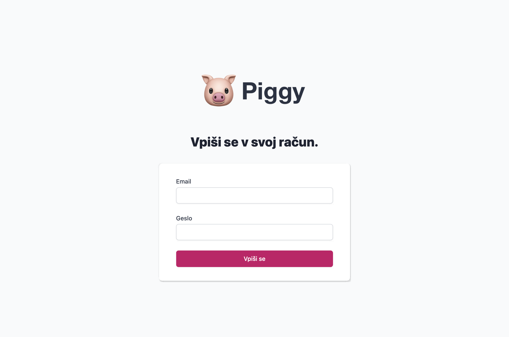
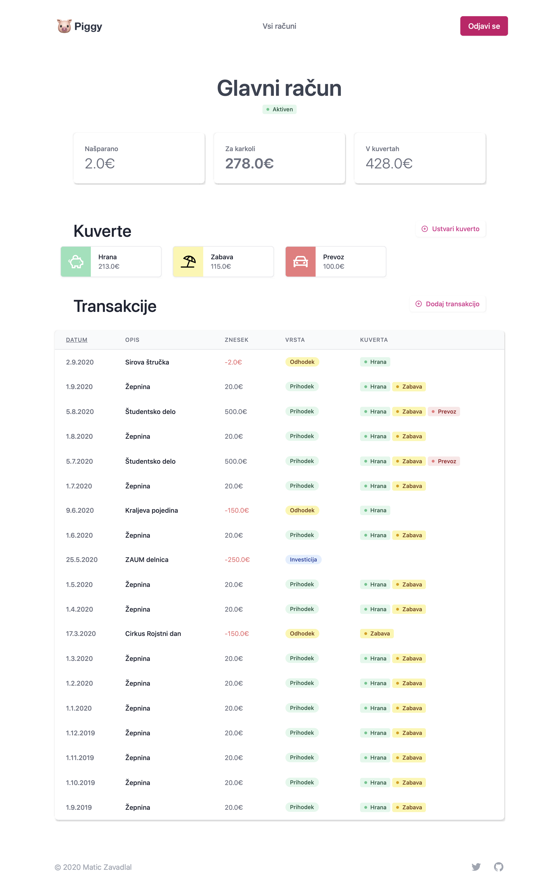

# 🐷 piggy

Budget planner za miljonarje.

🏡 **Skupen davek:** Del zaslužka zmeraj ostane meni za izboljšanje kakovosti življenja.
📨 **Kuvertni sistem evidence:** Kar lahko porabim namensko razdelim v kuverte.
😍 **Hiter pregled:** Domač pogled mi omogča hiter pregled nad količino denarja, ki ga imam.

## Zagon

Za zagon Piggy-ja je potrebno s spleta namestiti vse pomožne knjižnice. To lahko naredite z ukazom

```bash
pip install -r requirements.txt
```

Spletni vmesnik nato zaženete z

```bash
python main.py
```

## Uporaba

Piggy podpira tako uporabo na računalniku kot na mobilnih napravah.

> Za testiranje lahko uporabiš email: "test@mail.com" in geslo "test". Piggy bo poizkušal te dadoteke prenesti iz mape import, ki naj bo znotraj poti kjer zaženemo bottle.

### Vpis

Za vpis v račun vpišeš email in geslo. Če se kombinacija ujema z obstoječim uporabnikom v sistemu se bo zgodila prijava.

Za ustvarjanje računa vpišeš email in geslo. Če email še ni bil uporabljen, se bo ustvaril nov račun, drugače pa lahko vanj vstopiš z geslom, ki si ga nastavil. Če vpisano geslo ni pravilno ti bo to Piggy sporočil.

<div align="center">
   
</div>

### Ustvarjanje računa

Piggy omogoča vodenje večih računov hkrati. Ko se prvič vpišeš ali pa še nimaš računa, ti bo Piggy pomagal, da ga ustvariš.

Vsak račun ima nastavljen "davek". Davek je del prihodkov, ki ga ne glede na vrsto prihodka zmeraj nameniš v "kuverto za boljše življenje". Ta kuverta je namenjena izdatkom, ki ti omogočajo osebnostno rast in razvoj. V njo gredo naprimer račun za tečaj tujega jezika, ali pa denar, ki si ga namenil za nakup stanovanja, ki ga boš oddajal. V njo ne pašejo stvari kot so sladoled ali pa kino in podobno. Za take izdtake si boš ustvaril kuverto.

Davek v računu lahko nastaviš samo na začetku, zato ga nastavi pametno. Boljše je, če se odločiš za nižji davek s katerim lahko shajaš, kot za visok davek, ki ga ne moraš dohajati.

### Ustvarjanje kuvert

Izdatke si je glede na namen najboljše razdelit v posamezne kuverte. Na primer, nekaj denarja želimo namenit za hrano, privoščimo pa si tudi nekaj zabave. Ustvarili bomo dve kuverti - hrana in zabava.

Vsaki kuverti damo ime, ki si ga bomo najlažje zapomnili. Za lepše pa si lahko izberemo še barvo kuverte in ikono.

V domačem pogledu lahko vidimo koliko denarja je na voljo v posamezni kuverti. Denarja je lahko tudi manj kot nič - takrat se bo kuverta obravala rdeče - a strmimo k temu, da nikoli ne porabimo več kot smo v kuverto namenili.

<div align="center">
   
</div>

### Ustvrajanje transakcij

Na koncu je čas, da začnemo polnit svoj račun. Transakcije glede na obliko razdelimo na:

- mesečne in enkratne prihodke,
- odhodke in
- investicije.

Recimo, da preko študentskega servisa na mesec zaslužimo 500€. Ustvariti želimo mesečni prihodek. Del prihodka - "davek" - bo šel v kuverto z investicijami (npr. 100€, če izberemo 20% davek). Preostali del zaslužka bomo razdelili tako, da za hrano namenimo 150€ in za zabavo 20€. Ostane nam še 230€, ki jih lahko porabimo kakor želimo (npr. si kupimo trobento).

V primeru, da smo narobe razporedili denar v kuverte nas bo Piggy odnesel nazaj na obrazec in nam javil napako.

Recimo še, da nam babica stisne v žep 50€, ker se nas kar ne mora nagledat. Ustvarimo enkratni prihodek in vse namenimo za zabavo (40€). To naredimo enako kot prej, le da ne odkljukamo polja mesečni prihodek. Enkratni prihodki se ne ponavljajo čez mesece.

Ker se je ravno začelo šolsko leto bomo organizirali veliko zabavo na vrtu. Gremo v trgovino in zapravimo 50€. Ustvarili bomo odhodek iz kuverte zabava.

### Urejanje in pregled transakcij

Transakcije lahko v tabeli na strani račun uredimo tako, da kliknemo na ime stolpca po katerem želimo transakcije razvrstiti.

Za urejanje transakcije kliknemo na opis posamezne transakcijo. Mesečne transakcije lahko tam zaključimo, lahko pa tudi spremenimo razdelitev po kuvertah in opise transakcij. Zneskov ne moramo spreminjati, saj bi lahko tako investirali več kot imamo na voljo.

<div align="center">
   
</div>

### Odjava in shranjevanje

Piggy vsak korak nemudoma shrani v sistem. Ko smo z urejevanjem končali lahko tako preprosto kliknemo gumb odjava in se iz sistema odjavimo.

## Nastavitev razvijalskega orodja

### Kako nastaviti Python

Priporočam, da si nastavite `virtualenv` pred začetkom razvijanja, da se knjižnice, ki jih uporablja Piggy ne bodo teple z ostalimi knjižnicami na vašem računalniku.

Kako namestiti `virtualenv` si lahko preberete [tukaj](https://packaging.python.org/guides/installing-using-pip-and-virtual-environments/).

> Ne pozabite zagnati `virtualenv`!

Za razvijanje Piggy-ja je potrebno s spleta namestiti vse pomožne knjižnice. To lahko naredite z ukazom

```bash
pip install -r requirements.txt
```

Če boste uporabljali nove pomožne knjižnice, jih dodajte na seznam s pomočjo

```bash
pip freeze > requirements.txt
```

> VSCode: Če uporabljate za razvijanje VSCode je najlažje usposobit `virtualenv` tako, da iz terminala odprete VSCode (`code .`) in nato izberete default Python interpreter.

### Spreminjanje CSS

CSS spremeni v mapi `styles`, ne v `public`, in nato poženi `yarn compile:css`, da se prevede in doda v `public`.
